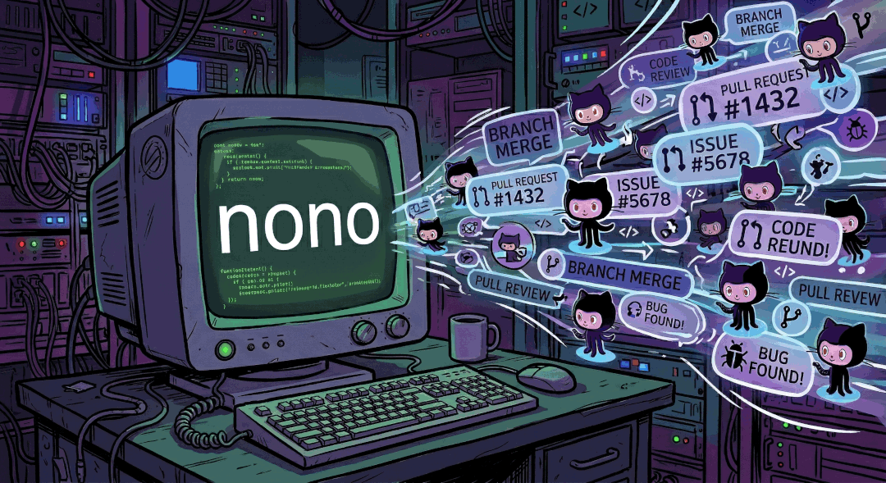

<div align="center">
  
</div>

# nono-dev

Development environment and sandboxed workflow manager for the [nono](https://github.com/always-further/nono) project. Provides two things:

1. **OrbStack Linux VMs** with Rust build toolchains for cross-compilation on macOS.
2. **Sandboxed AI workflows** -- issue triage, bug fixing, PR review, and feature development, each isolated in a git worktree with [nono](https://docs.nono.sh) sandbox protections.

See the [Documentation](https://always-further.github.io/nono-dev/) to get started!

## Prerequisites

- macOS with [OrbStack](https://orbstack.dev/) (for VM commands)
- [nono](https://docs.nono.sh/cli/getting_started/installation) (for sandbox commands)
- [GitHub CLI](https://cli.github.com/) (`gh`) installed and authenticated
- [Claude Code](https://claude.ai/code) CLI
- Python 3.11+ with [uv](https://docs.astral.sh/uv/) or pip

## Installation

```bash
git clone https://github.com/always-further/nono-dev.git
cd nono-dev
uv sync
```

Optional shell integration (enables the `wt` function for changing into worktrees):

```bash
echo 'eval "$(nono-dev shell-init)"' >> ~/.zshrc
```

## Quick Start

### Sandbox workflows

```bash
# Triage a GitHub issue
nono-dev triage 42

# Fix a bug in an isolated worktree
nono-dev fix 123

# Review a pull request
nono-dev review 456
nono-dev review https://github.com/org/repo/pull/456

# Start a new feature
nono-dev feature my-feature
```

All sessions run detached in nono sandboxes with rollback enabled. Manage them with:

```bash
nono-dev sb status              # Dashboard of sessions and worktrees
nono-dev sb attach 123          # Attach to a session by issue number
nono-dev sb attach fix-123      # Or by session name
nono-dev sb stop review-456     # Stop a session
```

### Worktree management

```bash
nono-dev wt list                # List managed worktrees
wt issue-123                    # cd into a worktree (requires shell-init)
nono-dev wt cleanup issue-123   # Remove a worktree and its branch
nono-dev wt cleanup --all       # Remove all managed worktrees
```

### OrbStack VMs

```bash
nono-dev vm create              # Create a Debian VM with Rust toolchain
nono-dev vm create --shell-setup  # With zsh, starship, eza, tmux, ripgrep, fzf
nono-dev vm connect             # SSH into the VM
nono-dev vm status              # List VMs
nono-dev vm destroy             # Delete the VM
```

## Configuration

Create `nono-dev.toml` in your project root (optional -- repo is auto-detected from git remote):

```toml
[project]
repo = "always-further/nono"

[worktree]
dir = ".worktrees"

[rollback]
enabled = true
```

See [Configuration docs](docs/configuration.md) for all options.

## CLI Reference

```
nono-dev triage <issue>           Triage a GitHub issue
nono-dev fix <issue>              Fix a GitHub issue in a worktree
nono-dev review <pr>              Review a GitHub PR
nono-dev feature <branch>         Start a feature in a worktree

nono-dev vm create|connect|status|destroy|recreate
nono-dev sb status|attach|stop|prune
nono-dev wt list|cd|cleanup
nono-dev git commit               AI-generated conventional commit

nono-dev shell-init               Print shell functions for .zshrc
```

Issues and PRs accept both numbers (`123`) and GitHub URLs.

## VM Environment

VMs created with `nono-dev vm create` include:

- Rust toolchain (rustup) with cargo-audit
- Build dependencies: build-essential, pkg-config, libssl-dev, cmake, git, curl
- `CARGO_TARGET_DIR` set to `~/.cargo_target_linux` (avoids conflicts with macOS builds)
- Project mounted at `~/project`
- SSH agent forwarding

With `--shell-setup`:

- zsh with starship prompt (Nerd Font icons)
- eza (ls replacement with icons), ripgrep, fzf, tmux, z
- Pre-configured dotfiles (.zshrc, .tmux.conf, starship.toml)
