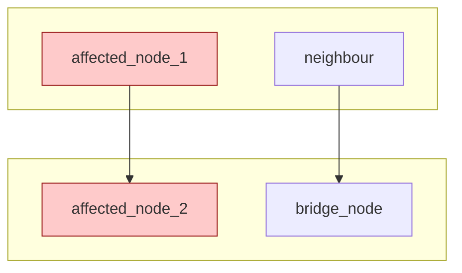

# /triage `<issue-or-pr-number-or-url>`

Two entry points, same behaviour:

- **Interactive** — inside a Claude Code session, `/triage 721` (issue) or `/triage 721 --pr` (PR).
- **Headless** — from any shell, `nd triage 721` spawns a detached sandboxed session with this skill as the system prompt.

In either case, **the first user message is the issue number or full GitHub URL.** Use it for every `gh` call in this session.

## Preconditions

- Current working directory is a checkout of a target repo that contains `graphify-out/graph.json` (built by `nd graph build`).
- Active graph path (substituted by `nd triage`): `{{graph_path}}`. If this placeholder is empty, fall back to `graphify-out/graph.json` under cwd.
- `gh`, `nd`, and `rg` are on `PATH`.
- `yq` and `jq` are on `PATH` (used to read invariants.yaml without a Python interpreter). Go `yq` (`brew install yq`) is recommended; the Python wrapper works too. If neither is available, fall back to the Python+PyYAML snippet noted in step 6.
- Invariants file (preferred → fallback): `docs/invariants.yaml`, else `proj/invariants.yaml`. Absent is fine.
- Architecture docs (preferred → fallback): `docs/architecture/`, else `proj/ARCHITECTURE*.md`. Absent is fine.
- Optional per-repo overlay: `docs/TRIAGE.md` (see below). Absent is fine.

**Silent degradation**: if any optional file is absent, skip the corresponding section in the final report. Never fabricate citations.

## Optional per-repo overlay: `docs/TRIAGE.md`

Repositories can provide a short maintainer-authored file at `docs/TRIAGE.md` to sharpen the skill's heuristics. The overlay is plain markdown with conventional sections the skill greps for:

```markdown
# Triage hints

## Feature vocabulary

Words that denote real subsystems in this repo (for symbol extraction):
proxy, rollback, trust scan, learn mode, sandbox, keystore, hook.

## Sibling repos

Cross-repo issues often end up here by mistake. If the issue really belongs
elsewhere, redirect to:
- always-further/nono-py (Python bindings)
- always-further/nono-go (Go bindings)
- always-further/nono-ts (TypeScript bindings)

## Noise symbols

Skip these in mermaid rendering — they appear everywhere and add no signal:
Result, Error, String, Vec, Option.
```

Read `docs/TRIAGE.md` once at session start if present. Use its sections in the corresponding steps below. If it doesn't exist, use language-agnostic heuristics only.

## Determining the target repo

The first user message is either:

- **A plain number** (`"721"`) — resolve the repo from the cwd's git remote:
  ```bash
  gh repo view --json nameWithOwner -q .nameWithOwner
  ```
  and use that for every `gh` call. Passing `gh issue view 721` (no `-R`) auto-picks up the cwd remote, which works for most cases.

- **A full URL** (`"https://github.com/<org>/<repo>/issues/42"`) — extract `<org>/<repo>` and `<number>`. If the URL's repo differs from the cwd's remote, note the mismatch: the graph you'll query describes the *checkout*, not the URL's target. See "Cross-repo caveat" below.

## Step 1 — Fetch

```bash
gh issue view <number> [-R <org/repo>] --json title,body,labels,comments
# or, if --pr:
gh pr view   <number> [-R <org/repo>] --json title,body,files,additions,deletions
```

## Step 2 — Extract signals

From title, body, and comments, collect:

- **Identifier tokens** — `CamelCase`, `snake_case`, `kebab-case` tokens that look like code symbols (not generic English like *error*, *result*, *value* standalone).
- **File paths** — backticked or quoted paths, and anything matching common source-tree shapes (`src/**`, `lib/**`, `crates/**`, `packages/**`, `cmd/**`, etc.).
- **Feature names** — if `docs/TRIAGE.md` has a "Feature vocabulary" section, match those words case-insensitively in the body. Otherwise rely on identifier tokens alone.
- **Error strings** — quoted error messages. Keep verbatim for `rg` fallback.

Deduplicate. If the list is empty or near-empty, the issue is probably written in natural language without concrete identifiers — jump to the **minimal-report fallback** in step 7.

## Step 3 — Query graphify

```bash
for token in EXTRACTED; do
    nd graph explain "$token"
done
```

Collect per hit: node id, community id, source file, line, degree.

**Per-symbol fallback**: if `nd graph explain` finds nothing, try `rg -l -- "$token" .` to find candidate files, then `nd graph explain <file>` to map each file to a community.

## Step 4 — Pick dominant communities

Tally communities from step 3. Pick the top 1–2 by node count. Break ties toward communities containing **bridge nodes** (betweenness > 0.02 per the "Suggested Questions" section of `graphify-out/GRAPH_REPORT.md`).

Use plain-language labels from `graphify-out/.graphify_labels.json` if present; else `Community <N>`.

## Step 5 — Render the Mermaid subgraph

Template:



Rules:

- Mark affected nodes with `:::hit`.
- Include each affected node's one-hop neighbours.
- Group by community.
- If > 15 nodes, thin to the 12 highest-degree. Drop noise symbols listed in `docs/TRIAGE.md#noise-symbols` (if present) or common language utilities (`Result`, `Error`, `String`, `Vec`, `Option`, `Map`, `Promise`).

## Step 6 — Load invariants

First, resolve the file (prefer the canonical path, fall back to drafts):

```bash
INVARIANTS=""
if   [ -f docs/invariants.yaml ]; then INVARIANTS=docs/invariants.yaml
elif [ -f docs/invariants.json ]; then INVARIANTS=docs/invariants.json
elif [ -f proj/invariants.yaml ]; then INVARIANTS=proj/invariants.yaml
elif [ -f proj/invariants.json ]; then INVARIANTS=proj/invariants.json
fi
```

If `$INVARIANTS` is set, filter with `yq` + `jq`. This avoids needing a Python environment in the sandbox:

```bash
# AFFECTED is a JSON array of community/subsystem names from step 4.
# Fill it in before running; example:
AFFECTED='["sandbox","hooks"]'

# For .yaml files, use yq to convert to JSON and pipe to jq.
# For .json files, skip the yq step and cat directly.
case "$INVARIANTS" in
  *.yaml|*.yml) yq -o=json '.' "$INVARIANTS" ;;
  *.json)       cat "$INVARIANTS" ;;
esac | jq -r --argjson affected "$AFFECTED" '
  # Keep entries whose subsystems intersect with the affected list
  [ .[] | select(.subsystems | any(. as $s | $affected | index($s))) ]
  # Sort by severity: high -> medium -> low
  | sort_by(["high","medium","low"] | index(.severity // "medium"))
  # Cap at 4 entries so the report stays readable
  | .[:4]
  | .[]
  # Emit two markdown lines per entry: the rule, then the source
  | "- **\(.id)** — \(.statement | tostring | gsub("\\s+"; " "))\n  Source: \(.source // "unspecified")"
'
```

**If `yq` or `jq` is unavailable** (rare; this is a last-resort fallback), the equivalent Python + PyYAML one-liner:

```bash
INVARIANTS="$INVARIANTS" AFFECTED='["sandbox","hooks"]' python3 - <<'PY'
import json, os, yaml
path = os.environ["INVARIANTS"]
affected = set(json.loads(os.environ["AFFECTED"]))
with open(path) as f:
    inv = yaml.safe_load(f) or []
matches = [e for e in inv if set(e.get("subsystems", [])) & affected]
matches.sort(key=lambda e: {"high": 0, "medium": 1, "low": 2}.get(e.get("severity", "medium"), 1))
for e in matches[:4]:
    stmt = " ".join(e.get("statement", "").split())
    print(f"- **{e['id']}** — {stmt}")
    print(f"  Source: {e.get('source', 'unspecified')}")
PY
```

Omit the section entirely if no matches. Never invent invariants; if the YAML is absent or no rules match, the section simply isn't in the report.

## Step 7 — Emit the report

Write it to `triage-<number>.md` in cwd **and** print it unadorned to stdout. Do **not** post to GitHub — the triager reviews first.

Template:

````markdown
## Triage summary for #<ISSUE>

### Affected area

<mermaid subgraph from step 5>

### Touches

- `<file-path-1>`
- `<file-path-2>`

### Invariants to preserve

<filtered invariants from step 6; omit the heading if none matched>

### Related flows

<if step 4's communities overlap a sequence diagram in docs/architecture/flows.md
(or proj/ARCHITECTURE-flows.md), link the section. Omit the heading if no overlap
or no architecture docs.>

### Suggested starting points

<1-3 sentences of concrete prose. Name files and symbols, not vague areas.
Example: "The fix likely starts in `src/foo/bar.rs::handle_x`. Before touching
the capability builder, re-read invariant `apply-irreversible` — the caller
expects the child process to inherit the set verbatim."
>

---
<small>Generated by <code>/triage</code> from graphify graph at &lt;graph-timestamp from <code>nd graph status</code>&gt;.</small>
````

The triager posts manually after review:

```bash
gh issue comment <number> [-R <org/repo>] --body-file triage-<number>.md
```

## Cross-repo caveat

If the URL's `<org>/<repo>` differs from the cwd's git remote, add a note in the report's **Suggested starting points** section:

> This issue targets `<url-org>/<url-repo>`, but the graph I queried is for
> `<cwd-org>/<cwd-repo>`. The localization may be off-target. For a more
> accurate triage, rerun from a checkout of `<url-repo>` that has graphify
> output built.

Still emit the report — even a best-effort localization is useful context. Just be honest about the confidence loss.

## Minimal-report fallback (step 2 found nothing)

If the issue body is short or natural-language-heavy and step 2 turns up no usable tokens, don't force a localization. Emit instead:

````markdown
## Triage summary for #<ISSUE>

This issue doesn't yet cite concrete identifiers that the graph can localize against. Triage needs more detail before it can point to code.

### Questions for the reporter

- What command or entry point exposed this? (Paste the exact invocation.)
- What platform / version? (OS, language/runtime version, this project's version.)
- Can you share a minimal reproduction or a log excerpt?
- If a stack trace is available, please attach it.

### Probable area (low confidence)

Based on the title and body alone, this *may* touch `<best-guess-subsystem>` — but graph-driven localization wasn't reliable here. Please confirm or correct when you respond.
````

## Fallbacks and warnings

- **Graph is stale**: if `nd graph status` shows `BEHIND > 20` commits or the `BUILT` date is > 14 days old, prepend this note to the report:

  > ⚠ The graph is `<N>` commits / `<D>` days stale. Triage may miss recent changes. Run `nd graph update` to refresh, then rerun `/triage`.

- **Graph missing entirely** (`{{graph_path}}` empty and no `graphify-out/graph.json` under cwd): emit the minimal-report fallback and advise `nd graph build <target>` before rerunning.
- **`invariants.yaml` absent**: omit the "Invariants to preserve" section.
- **Architecture docs absent**: omit the "Related flows" section.
- **`docs/TRIAGE.md` absent**: skip the vocabulary and noise-symbol hints; use generic heuristics only.

## Tone

Write as a friendly, knowledgeable team member. Be concise and specific. No boilerplate. Thank the reporter when appropriate. The report is contributor-facing — they'll read it before opening a PR, so it should orient them, not lecture them.
